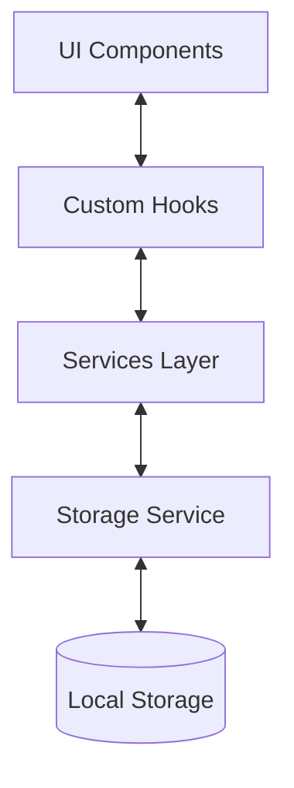

# Shield Companion Data Flow and Storage Documentation

## Overview

Shield Companion uses a layered architecture for data management with the following key components:
- React components for UI and user interaction
- Custom hooks for business logic and state management
- Services for data persistence and external interactions
- Local storage for data persistence

## Data Flow Architecture



## Component Data Flow

### Journal Entry Flow
1. User inputs data in UI components:
   ```typescript
   // Components capture user input
   <JournalEntry>
     <ShiftDetails /> // Shift timing and type
     <MoodSelector /> // Emotional state
     <CallsList />    // Calls attended
   </JournalEntry>
   ```

2. Data is managed by hooks:
   ```typescript
   // useJournal hook manages journal state
   const {
     entries,
     addEntry,
     updateEntry,
     removeEntry
   } = useJournal();
   ```

3. Services handle persistence:
   ```typescript
   // journalService.ts
   async function saveEntry(entry: JournalEntry) {
     await storageService.set(`journal_${entry.id}`, entry);
   }
   ```

## Storage Structure

### Local Storage Schema

```typescript
interface StorageSchema {
  // Journal Entries
  'journal_entries': string[];           // List of entry IDs
  'journal_entry_${id}': JournalEntry;   // Individual entries
  
  // Resources
  'resources': string[];                 // List of resource IDs
  'resource_${id}': Resource;            // Individual resources
  
  // Memory Vault
  'memories': string[];                  // List of memory IDs
  'memory_${id}': Memory;                // Individual memories
  
  // User Preferences
  'user_preferences': {
    theme: 'light' | 'dark';
    notifications: boolean;
    defaultShiftType: ShiftType;
  };
}
```

### Data Persistence Strategy

1. **Immediate Persistence**:
   ```typescript
   // Changes are saved immediately
   async function updateEntry(entry: JournalEntry) {
     await storageService.set(`journal_entry_${entry.id}`, entry);
   }
   ```

2. **Batch Operations**:
   ```typescript
   // Multiple items are updated together
   async function bulkUpdateEntries(entries: JournalEntry[]) {
     await Promise.all(
       entries.map(entry => 
         storageService.set(`journal_entry_${entry.id}`, entry)
       )
     );
   }
   ```

3. **Error Recovery**:
   ```typescript
   // Handles storage failures
   try {
     await storageService.set(key, value);
   } catch (error) {
     // Retry logic or user notification
   }
   ```

## State Management

### Component Level State
```typescript
// Local state for form inputs
const [formData, setFormData] = useState<JournalEntryForm>({
  content: '',
  mood: 'Good',
  tags: []
});
```

### Application State
```typescript
// Shared state via hooks
const {
  entries,
  isLoading,
  error,
  filters
} = useJournal();
```

## Data Validation

1. **Input Validation**:
   ```typescript
   function validateEntry(entry: JournalEntry): ValidationResult {
     return {
       isValid: entry.content.length > 0,
       errors: {
         content: entry.content.length === 0 ? 'Content required' : null
       }
     };
   }
   ```

2. **Type Safety**:
   ```typescript
   // Strict typing for all data structures
   interface JournalEntry {
     id: string;
     timestamp: string;
     content: string;
     mood: MoodType;
     // ...other fields
   }
   ```

## Error Handling

### Storage Errors
```typescript
async function handleStorageError(error: Error) {
  // Log error
  console.error('Storage operation failed:', error);
  
  // Notify user
  notifyUser({
    type: 'error',
    message: 'Failed to save your changes'
  });
  
  // Attempt recovery
  await retryOperation();
}
```

### Data Integrity
```typescript
function ensureDataIntegrity() {
  // Validate stored data structure
  const entries = await storageService.get<JournalEntry[]>('journal_entries');
  
  // Clean up orphaned entries
  const validEntries = entries.filter(entry => {
    return entry && typeof entry.id === 'string';
  });
  
  // Update storage if needed
  if (validEntries.length !== entries.length) {
    await storageService.set('journal_entries', validEntries);
  }
}
```

## Data Migration

### Version Management
```typescript
async function migrateData(fromVersion: string, toVersion: string) {
  const currentData = await storageService.get('app_data');
  
  switch(fromVersion) {
    case '1.0.0':
      // Migrate from 1.0.0 to 1.1.0
      await migrateTo110(currentData);
      break;
    // Handle other versions
  }
  
  // Update version
  await storageService.set('app_version', toVersion);
}
```

## Best Practices

1. **Data Consistency**
   - Always use transactions for related updates
   - Validate data before storage
   - Handle edge cases and errors

2. **Performance**
   - Batch operations when possible
   - Use pagination for large datasets
   - Implement caching for frequently accessed data

3. **Security**
   - Sanitize all user input
   - Don't store sensitive information
   - Use proper error handling

4. **Maintenance**
   - Regular data cleanup
   - Version control for data structure
   - Backup strategies

## Testing Data Flow

```typescript
describe('Journal Entry Flow', () => {
  it('should persist entry changes', async () => {
    // Create test entry
    const entry = createTestEntry();
    
    // Save entry
    await journalService.saveEntry(entry);
    
    // Verify persistence
    const stored = await storageService.get(`journal_entry_${entry.id}`);
    expect(stored).toEqual(entry);
  });
});
```
